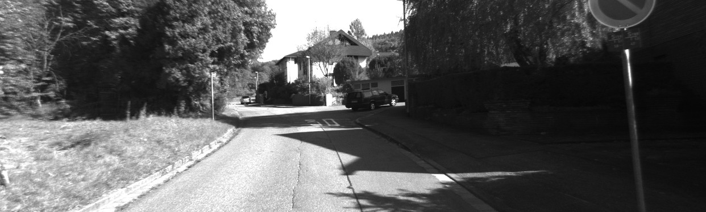
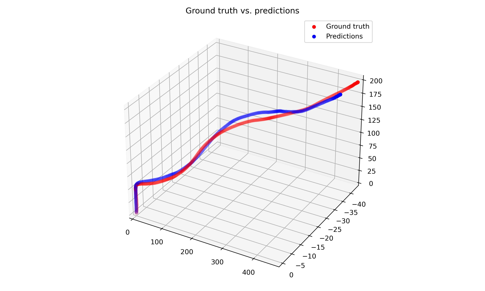

# Visual Odometry: Mapping Out the Camera Path

## Summary 
The goal of this class challenge (CS 585 Computer Vision) is to accurately estimate the path of a camera by recovering relative motion between successive frames. The camera’s intrinsic parameters are provided along with preprocessed frames
and ground truth coordinates. The only OpenCV functions used are for feature detection and reading images
as numpy arrays.

Binary Robust Invariant Scalable Keypoints (BRISK) is used to detect feature points and descriptors between
consecutive frames. K-Nearest Neighbor (kNN) matching is then utilized to extract the two best matches for
each descriptor so that Lowe’s ratio test can be applied [1]. Matches with the smallest distances are kept [3]. The fundamental matrix estimation is calcualted using Random Sample Consensus (RANSAC). Then, the essential matrix is calculated from the fundamental and camera calibration matrices. Lastly, linear triangulation is performed to determine the camera pose estimation.

## Results & Discussion

A Mean Squared Error of 4.81 was achieved on the training set. When calculating cheirality, including the condition that the z-coordinate of a 3D point must itself be positive—in addition to the constraint mentioned above—increased accuracy. Removing
outliers by using the Sampson distance also increased accuracy. Oriented FAST and Rotated BRIEF (ORB)
resulted in poor image matches, so BRISK was chosen because it is more robust to scale and rotation changes [2]. Implementing Lowe’s ratio test after applying kNN matching increased accuracy over the initial brute
force method [3]. Interestingly, most of the overall error comes from the y-coordinate, while the x and
z-coordinates are estimated with higher precision. A plot of the final camera pose predictions and the ground
truth coordinates is shown below. A direct least squares solution to the Perspective-n-Point pose estimation was attempted using reprojection error as the loss. However, the computation time exceeded the 20 minute limit.

## References 

1. Hartley, R., & Zisserman, A. (2004). Multiple View Geometry in Computer Vision (2nd ed.).
Cambridge: Cambridge University Press. doi:10.1017/CBO9780511811685
2. S. A. K. Tareen and Z. Saleem, "A comparative analysis of SIFT, SURF, KAZE, AKAZE, ORB, and
BRISK," 2018 International Conference on Computing, Mathematics and Engineering Technologies
(iCoMET), 2018, pp. 1-10, doi: 10.1109/ICOMET.2018.8346440.
3. Szeliski, R. (2021). Computer Vision: Algorithms and Applications (2nd. ed.). Springer-Verlag,
Berlin, Heidelberg.
